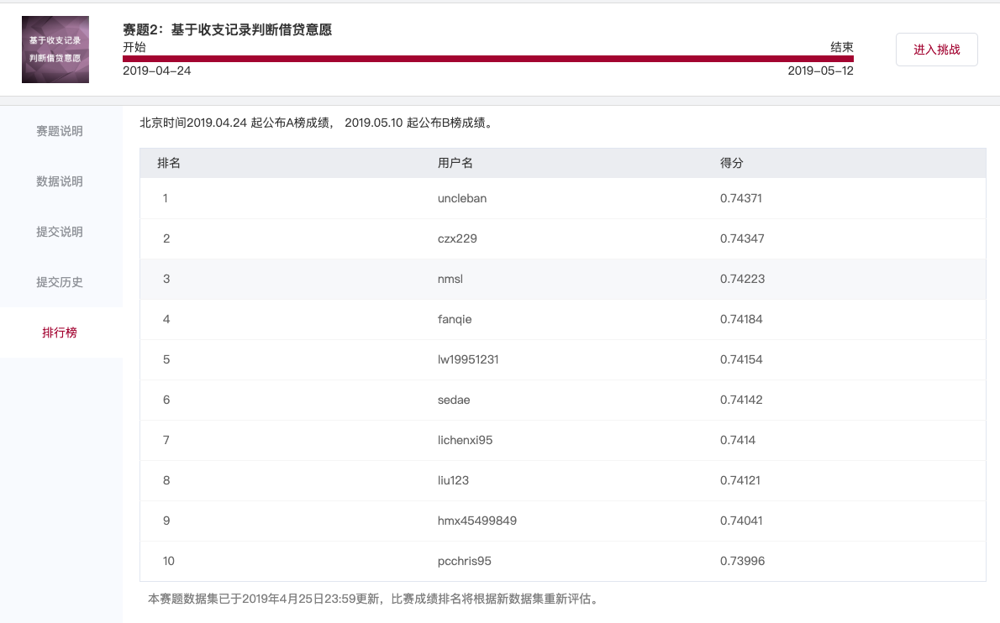

## 2019招行fintech精英训练营线上赛--赛题2开源代码

最终排名：第二名

融合模型最高分：A榜：0.74062；B榜：0.74347

单模型最高分：A榜：0.73989；B榜：0.7422



### 题目介绍

赛题2：基于收支记录判断借贷意愿

手机APP的首页首屏，是流量最大的页面，对应页面资源极其珍贵。现要将借钱卡片投放到首页，展现给最有点击意愿的用户。请基于用户真实的历史收支数据来预测用户是否会点击借钱卡片。

### 解决方案

#### 特征

```python
features227 = train227[['id']]

用户基础属性227 = pd.read_csv(features_dir227 + "用户基础属性.csv")
features227 = pd.merge(features227, 用户基础属性227, on='id', how='left')

收入总和227 = pd.read_csv(features_dir227 + "收入总和.csv")
features227 = pd.merge(features227, 收入总和227, on='id', how='left')

支出总和227 = pd.read_csv(features_dir227 + "支出总和.csv")
features227 = pd.merge(features227, 支出总和227, on='id', how='left')

收支总和227 = pd.read_csv(features_dir227 + "收支总和.csv")
features227 = pd.merge(features227, 收支总和227, on='id', how='left')

收支记录次数227 = pd.read_csv(features_dir227 + "收支记录次数.csv")
features227 = pd.merge(features227, 收支记录次数227, on='id', how='left')

收入最大值227 = pd.read_csv(features_dir227 + "收入最大值.csv")
features227 = pd.merge(features227, 收入最大值227, on='id', how='left')

支出最大值227 = pd.read_csv(features_dir227 + "支出最大值.csv")
features227 = pd.merge(features227, 支出最大值227, on='id', how='left')

各类别收支记录次数227 = pd.read_csv(features_dir227 + "各类别收支记录次数.csv")
features227 = pd.merge(features227, 各类别收支记录次数227, on='id', how='left')

各类别收支金额227 = pd.read_csv(features_dir227 + "各类别收支金额.csv")
features227 = pd.merge(features227, 各类别收支金额227, on='id', how='left')

# 加入以下两个特征后，有明显提升
各原始类别收支记录次数227 = pd.read_csv(features_dir227 + "各原始类别收支记录次数.csv")
features227 = pd.merge(features227, 各原始类别收支记录次数227, on='id', how='left')

各原始类别收支金额227 = pd.read_csv(features_dir227 + "各原始类别收支金额.csv")
features227 = pd.merge(features227, 各原始类别收支金额227, on='id', how='left')

收入均值227 = pd.read_csv(features_dir227 + "收入均值.csv")
features227 = pd.merge(features227, 收入均值227, on='id', how='left')

支出均值227 = pd.read_csv(features_dir227 + "支出均值.csv")
features227 = pd.merge(features227, 支出均值227, on='id', how='left')

收支均值227 = pd.read_csv(features_dir227 + "收支均值.csv")
features227 = pd.merge(features227, 收支均值227, on='id', how='left')

# 选24个得分最高的原始类别特征，两两相加，得到288维特征，然后再筛选，略有提升
原始类别次数两两相加组合特征227 = pd.read_csv(features_dir227 + "原始类别次数两两相加组合特征.csv")
features227 = pd.merge(features227, 原始类别次数两两相加组合特征227, on='id', how='left')

原始类别金额两两相加组合特征227 = pd.read_csv(features_dir227 + "原始类别金额两两相加组合特征.csv")
features227 = pd.merge(features227, 原始类别金额两两相加组合特征227, on='id', how='left')
```

#### 模型：xgboost

```python
def pipeline(iteration,random_seed,max_depth,lambd,subsample,colsample_bytree,min_child_weight):
    if max_depth==3:
        n_estimators = 400
    elif max_depth==4:
        n_estimators = 300
    kf = StratifiedKFold(n_splits=5, shuffle=True, random_state=42)
    preds306 = np.zeros((X306_csr.shape[0]))
    i = 0
    models = [0]*kf.get_n_splits()
    roc_scores = []
    for train_index, val_index in kf.split(X227_csr, Y227):
        X_train, X_val = X227_csr[train_index], X227_csr[val_index]
        y_train, y_val = Y227[train_index], Y227[val_index]
        eval_set = [(X_train, y_train), (X_val, y_val)]

        models[i] = xgb.XGBClassifier(n_estimators=n_estimators,
                              max_depth = max_depth,
                              reg_lambda = lambd,
                              subsample = subsample,
                              colsample_bytree = colsample_bytree,
                              min_child_weight = min_child_weight,
                              n_jobs = 6,
                              random_state=random_seed)
        models[i].fit(X_train, y_train, eval_metric=['auc', "error", "logloss"], eval_set=eval_set, verbose=False)

        score = models[i].predict_proba(X_val)[:, 1]

        roc = roc_auc_score(y_val, score)
        roc_scores.append(roc)

        print(roc)

        preds306 = preds306 + models[i].predict_proba(X306_csr)[:,1]

        i+=1

    preds306 = preds306 / kf.get_n_splits()
    pickle.dump(preds306, open(inter_dir + 'preds306_'+str(iteration)+'.p', 'wb'))
    pickle.dump(models, open(inter_dir + 'models_'+str(iteration)+'.p','wb'))
    pickle.dump(roc_scores, open(inter_dir + 'roc_scores_'+str(iteration)+'.p','wb'))
    print("mean_roc_score: {}".format(np.mean(roc_scores)))
    
```

#### 融合：ranking

随机参数，训练出30个模型。

```python
random.seed(42)
random_seed = list(range(43))
max_depth = [3,4]
lambd = list(range(0,5))
subsample = [i/1000.0 for i in range(700,800)]
colsample_bytree = [i/1000.0 for i in range(700,800)]
min_child_weight = [i/100.0 for i in range(150,250)]
# n_feature = range(150,282,2)

random.shuffle(random_seed)
random.shuffle(max_depth)
random.shuffle(lambd)
random.shuffle(subsample)
random.shuffle(colsample_bytree)
random.shuffle(min_child_weight)
```

然后做融合。

ranking是先把每个模型的结果排序，然后再求平均。

比赛中发现，ranking比bagging（直接对每个模型结果求平均），略微好一丁点。

### 其它开源

- uncleban (第一名)

大家久等的开源来了~~
https://github.com/uncleban/2019_cmb_fintech
第二题a榜第一baseline，这份代码可以复现线上a榜0.74151，b榜0.74242的成绩。提取特征部分用时2min左右，模型训练用时6min左右。
整理不易，大家的star就是最好的回报，谢谢大家，欢迎转发~

- VoyagerIII

B榜0.73611 交流分享，欢迎star
用的XGBoost  特征两百维，有一定注释。
https://github.com/VoyagerIII/CERES